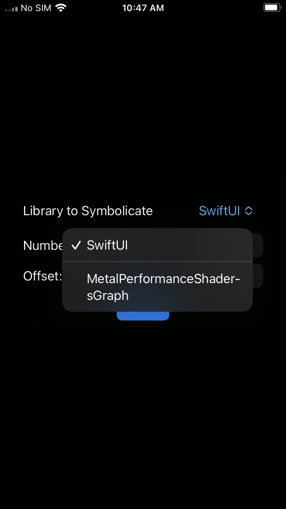
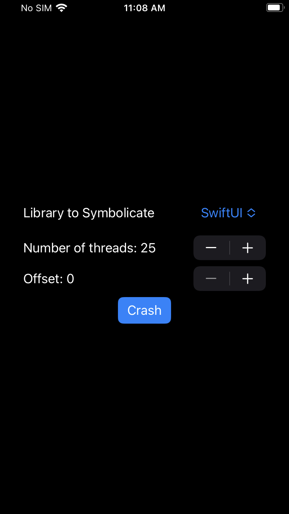
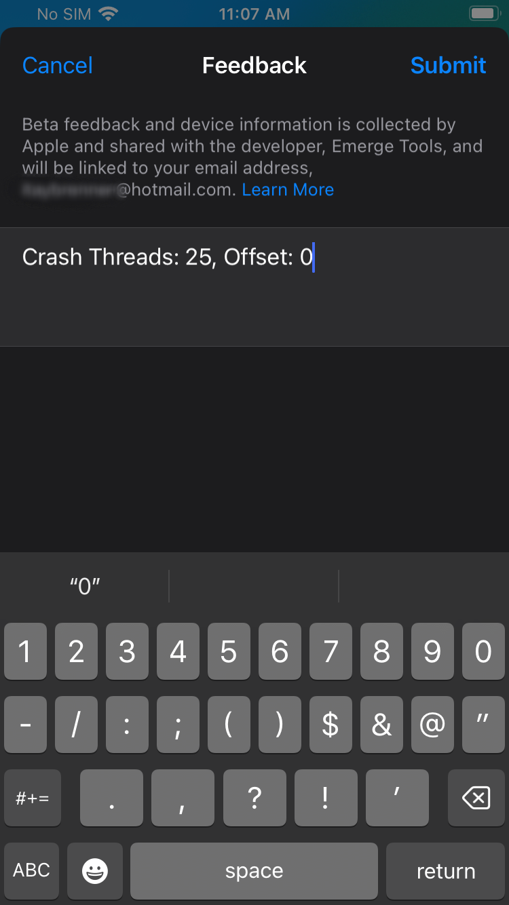
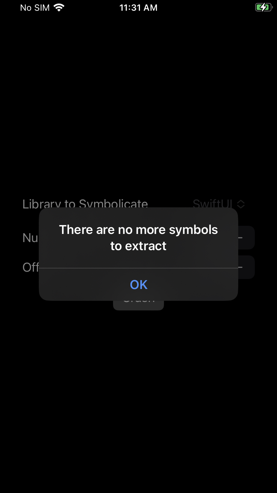

# ETSymbolication

ETSymbolication is a powerful tool that enables symbolicating crash reports even when the symbols are not openly distributed by Apple. It leverages Apple's crash reporting service to extract the necessary symbols and provide meaningful information for crash analysis.

## Features
- Symbolicate all crash reports
- Utilize Apple's crash reporting service for symbol extraction
- Simplify crash analysis and debugging process

## Prerequisites

To use ETSymbolication, ensure that you have the following prerequisites:

- macOS

If the required Binary has not been extracted yet:
- iOS Device on the correct version
- An Apple Developer Account if the required Binary has not been extracted yet

## Extracting Framework Symbols

1. Open the Xcode Project (`ETSymbolication.xcodeproj`).
2. Make sure your Framework is listed in the array inside `Libraries.swift`.
3. Create a new version and upload it to TestFlight.
4. Download it on the device you want to work on.
5. Open the App.
6. Select your app in the picker

    

7.  Select the number of threads and the offset to crash with.
    - **Threads:** Each thread is capable of extracting 500 symbols, the more threads you are using, the less crashes you need to fully extract them. But keep in mind that using too many threads may need more time for apple's crash reporting service to make the crash available for download.
    - **Offset:** Since you will need multiple crashes to fully extracts the symbols, the offset parameter is used to indicate at which memory address to start. If we split the full list of symbols a binary has by the number of symbols per crash (threads * 500), the offset indicates which position in the array we will start working from.

    

8. Press crash

    

9. Upload the crash (you can use the feedback field to enter the parameters used)

    

10. Repeat increasing the offset by 1 (and keeping the number of thread fixed) until you see an alert saying `There are no more symbols to extract`.

    

