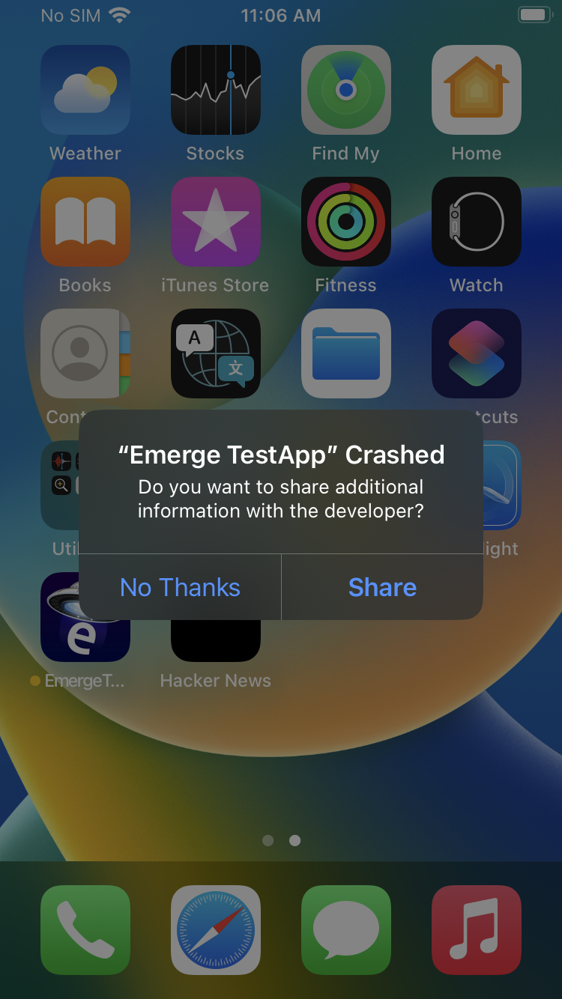

# ETSymbolication

ETSymbolication is a powerful tool that enables symbolicating crash reports even when the symbols are not openly distributed by Apple. It leverages Apple's crash reporting service to extract the necessary symbols and provide meaningful information for crash analysis.

## Features
- Symbolicate all crash reports
- Utilize Apple's crash reporting service for symbol extraction
- Simplify crash analysis and debugging process

## Prerequisites

To use ETSymbolication, ensure that you have the following prerequisites:

- macOS

If the required Binary has not been extracted yet:
- iOS Device on the correct version
- An Apple Developer Account if the required Binary has not been extracted yet

## Extracting Framework Symbols

1. Open the Xcode Project (`ETSymbolication.xcodeproj`).
2. Make sure your Framework is listed in the array inside `Libraries.swift`.
3. Create a new version and upload it to TestFlight.
4. Download it on the device you want to work on.
5. Open the App.
6. Select your app in the picker

<center>
    
</center>

7.  Select the number of threads and the offset to crash with.
    - **Threads:** Each thread is capable of extracting 500 symbols, the more threads you are using, the less crashes you need to fully extract them. But keep in mind that using too many threads may need more time for apple's crash reporting service to make the crash available for download.
    - **Offset:** Since you will need multiple crashes to fully extracts the symbols, the offset parameter is used to indicate at which memory address to start. If we split the full list of symbols a binary has by the number of symbols per crash (threads * 500), the offset indicates which position in the array we will start working from.

<center>
    
</center>

8. Press crash

<center>
    
</center>

9. Upload the crash (you can use the feedback field to enter the parameters used)

<center>
    
</center>

10. Repeat increasing the offset by 1 (and keeping the number of thread fixed) until you see an alert saying `There are no more symbols to extract`.

<center>
    
</center>

## Building Symbols from Crashes

1. Go to [AppStoreConnect](https://appstoreconnect.apple.com/).
2. Login with your dev account.
3. Go to your App -> TestFlight -> Crashes.
4. Wait until you see all your crashes and see an button "Open in Xcode" when you hover over the crash (otherwise it will not be ready yet).

<center>
    
</center>

5. Press over the crash (but not "Open in Xcode") and download the crash to yor computer using the download button on the top right corner.

<center>
    
</center>

6. Repeat for all the crashes.
7. Unzip the downloaded files and place the `*.crash` files inside a new folder.
8. Execute `SymbolsBuilder` binary with the following parameters:
    - **--input:** path to the folder containing the crashes.
    - **--output:** path to the folder that will have the symbols file.
    - **--library-name:** name of the Framework.
    - **--library-linker-address:** Framework's linker address (it depends on the device and OS). See next section to see how to get it.

## How to get Framework linker address

1. Download your device IPSW: [https://ipsw.me](https://ipsw.me).
2. Install [ipsw](brew install blacktop/tap/ipsw) tool.
    - `brew install blacktop/tap/ipsw`
3. Extract the shared cache from the IPSW.
    - `ipsw extract --dyld PATH_TO_IPSW`
4. Install [DyldExtractor](https://github.com/arandomdev/DyldExtractor).
    - `python3 -m pip install dyldextractor`
5. Extract your framework.
    - `dyldex -e /System/Library/Frameworks/YOUR_FRAMEWORK.framework/YOUR_FRAMEWORK ./PATH_TO_EXTRACTED_IPSW/dyld_shared_cache_arm64e`
    - Replace YOUR_FRAMEWORK with your framework name
    - The extracted binaries will be located inside a new folder called `binaries/System/Library/Frameworks/YOUR_FRAMEWORK.framework/`.
7. Print the binary load commands
    - `otool -l binaries/System/Library/Frameworks/YOUR_FRAMEWORK.framework/YOUR_FRAMEWORK | grep LC_SEGMENT -A8`
    - Look for the section with `segname __TEXT` and the `vmaddr` value will be the linker address.

Example for MetalPerformanceShadersGraph:
```
otool -l binaries/System/Library/Frameworks/MetalPerformanceShadersGraph.framework/MetalPerformanceShadersGraph | grep LC_SEGMENT -A8

Output:
      cmd LC_SEGMENT_64
  cmdsize 1112
  segname __TEXT
   vmaddr 0x00000001800fc000
   vmsize 0x0000000000c5c000
  fileoff 0
 filesize 12959744
  maxprot 0x00000005
 initprot 0x00000005
 ```
The linker adddress is `0x00000001800fc000`

## Available Symbols

You will fin available symbols inside the `Symbols` folder. Each folder inside represents a different device, for example `iPhone 12,8` represents symbols for the iPhone SE 2nd gen.

<details>
<summary><b><font size="+1">iPhone SE 2nd Gen (iPhone 12,8)</font></b></summary>
<table>
  <tr>
    <th>OS Version</th>
    <th style="text-align: center;">SwiftUI</th> 
  </tr>
  <tr>
    <td>iOS 16.5 (20F66)</td>
    <td style="text-align: center;"><center>✅</center></td>
  </tr>
  <tr>
    <td>iOS 16.5.1 (20F75)</td>
  <td style="text-align: center;"><center>✅</center></td>
  </tr>
  <tr>
    <td>iOS 17.0 Beta 6 (21A5312c)</td>
  <td style="text-align: center;"><center>✅</center></td>
  </tr>
  <tr>
    <td>iOS 17.1.1 (21B91)</td>
  <td style="text-align: center;"><center>✅</center></td>
  </tr>
</table>
</details>